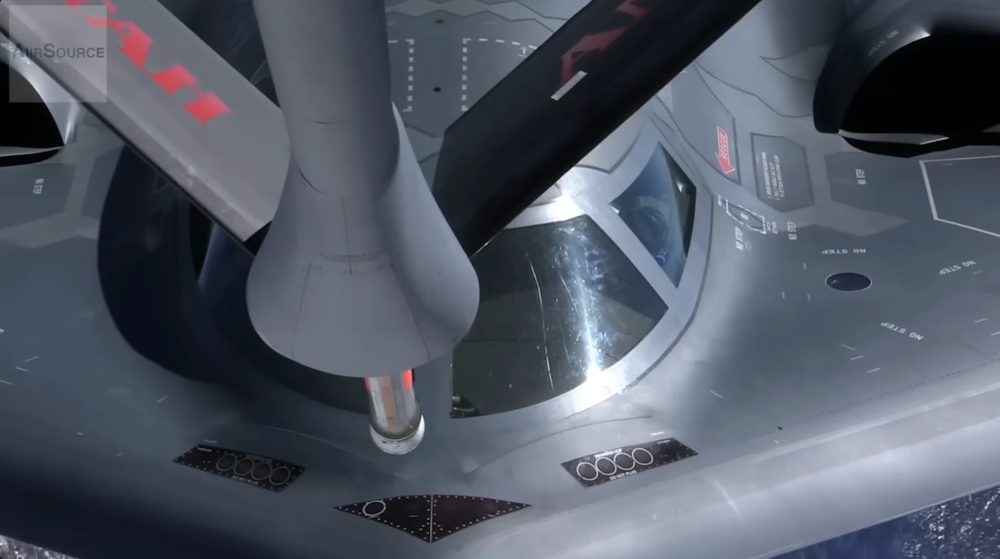

---
date:
    created: 2026-04-30
---

# April 2026: Top Albums

All of these except Slayyyter were recommendations from other people

<!-- more -->

## 1. Slayyyter - WOR$T GIRL IN AMERICA

<video controls width="100%">
  <source src="/assets/2026-apr-albums/slayyyter-st-loser.webm" type="video/webm">
</video>

spite

great music videos. I come back to BEAT UP CHANEL$, CANNIBALISM!, OLD TECHNOLOGY, CRANK, GAS STATION, and lately $T. LOSER most of all.

gets me up and going (and lately very little does)

## 2. If These Trees Could Talk - Red Forest

<iframe width="560" height="315" src="https://www.youtube-nocookie.com/embed/Ar3XsdlW2Ow?si=u6FP7dketYvupkay" title="YouTube video player" frameborder="0" allow="accelerometer; autoplay; clipboard-write; encrypted-media; gyroscope; picture-in-picture; web-share" referrerpolicy="strict-origin-when-cross-origin" allowfullscreen></iframe>

I listened to Red Forest in the latter half of the month while working on things at the OCF. It has no lyrics, very good for focusing. I was at first listening to it on the bandcamp website, but found that there was some static noise between each song. That ruins how the songs actually flow together on the full album, so I switched to youtube. I looped it so many times that I tried to buy a CD, but they didn't ship to the US, so I got one off ebay instead. I do not normally classify myself as a post-rock or post-metal fan... but now I'm willing to give more of it a shot.

## 3. Duckwrth - All American F⭐️ckBoy

<video controls width="100%">
  <source src="/assets/2026-apr-albums/toxic-romantic.webm" type="video/webm">
</video>

The album title oddly parallels Slayyyter's. Toxic Romantic is my #1, LA traffic is second, plus Escapist and Had Enough are getting up there... I anticipate every song will grow on me soon. I'd like to take a closer look at the album's storyline, it has interesting intermissions and music videos that appear to have a continuous narrative.

## 4. Penelope Scott - Water Dogs

<iframe style="border: 0; width: 400px; height: 406px;" src="https://bandcamp.com/EmbeddedPlayer/album=632752/size=large/bgcol=ffffff/linkcol=0687f5/artwork=small/transparent=true/" seamless><a href="https://penelopescott.bandcamp.com/album/water-dogs">Water Dogs by Penelope Scott</a></iframe>

This one is on my ipod shuffle, downloaded because I was trying to show off my yt-dlp script and asked for a recommendation. Although, I also ended up putting all the Penelope Scott songs in my library on there as well. The opening of Naiad Girl caught my attention this morning. Another person pointed out to me that Penelope Scott's concepts, her lyrics...... she gets it perfectly; she just needs better production. Water girl is catchy and lovely. Water girl, water girl, planes that intersect mid-air

[B-2 Stealth Bomber In-flight Refueling](https://www.youtube.com/watch?v=k56OoEbuJEk)

## bonus

some scattered dominic fike across different albums and singles... in the ipod rotation, but he doesn't make the list this time.

I used to think I wasn't an "album" listening person, back in high school when I was entirely on Spotify. But it turns out I just didn't make myself listen to albums often. Now in college, with my manually downloaded local music library on my laptop, ipod shuffle, and cd player setup... without streaming... albums are now easier to reach for.
