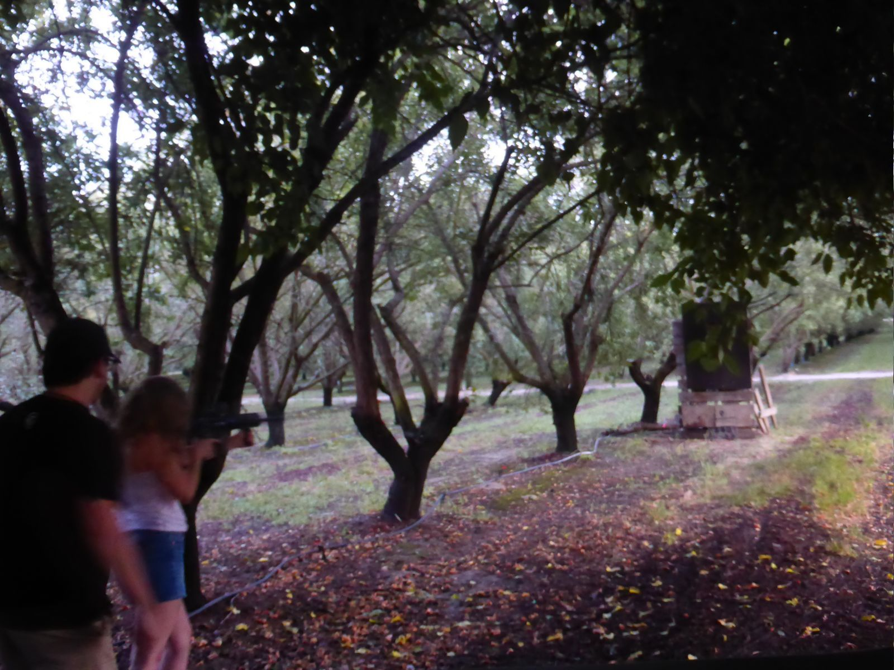

<!-- more -->

I went home on Friday, July 3rd. My friend picked me up from the train station. I couldn't believe the thick heat in the air. It was nice for a bit, but it got miserable fast. We drove to her aunt's new house that she was house sitting. 2 dogs, 2 cats, maybe more. The calico cat was named Peaches and she had huge, wide-set eyes for her tiny head. She would roll over on the floor with her belly up, then run to the other room and mewl loudly.

We went to In 'n Out and looked at the birds outside. She tossed them a fry and the biggest one got it. The big birds there sing very beautifully. I like the finches too, they are so small, and there are so many. A sports car passed sometimes and stopped our conversation with its noise.

Then I was home, and I played Binding of Isaac on the couch with my dad. I got my controller and bluetooth to work with my Linux laptop after asking claude code a few questions about what to add to my configuration. My dad would curse when he died; he eventually got mad and quit. I was doing pretty well though, got to the 4th stage. But it's pretty luck-based anyway.

The next day I went to another friend's house in the country for 4th of july. I started drinking too early. But it made the pool less cold. I'd found the perfect swimsuit at the bottom of my drawer and I couldn't believe it; it didn't fit too small or too loosely. There was a new dog there with heterochromia, he was black with an american flag collar, and his name was Thor. A big black labrador. And a little black-and-white dog who looked so scared that he'd be put back into the pool water, but he didn't want to go far from people regardless. Someone had bought a copy of *A Room of One's Own* by Virginia Woolf for me as a gift, and I was so happy. It's pocket-sized with a beautiful light blue hard cover. I slept on the concrete floor that night but I didn't really mind.

I left early enough the next morning to go to Mass with my mom. She became Catholic awhile ago, and I thought it'd be nice to go with her, although we were Protestant growing up. She loves the hymns and how it is straightforward worship, very routine-based and steeped in tradition. I couldn't find anything appropriate to wear at first, but I wore my dress from the eigth grade dance with a white button-up to cover my shoulders. The dress was long and black with blue swirls at the bottom. I thought I looked pretty silly, but she thought I looked nice. I liked the hymns too, but I wished people could figure out how to make their babies stop crying. I kept the dress on when I got back to the house. It was surprisingly comfortable.

The photo is from 4th of july. I didn't shoot because I was drinking, but it was nice to watch.
