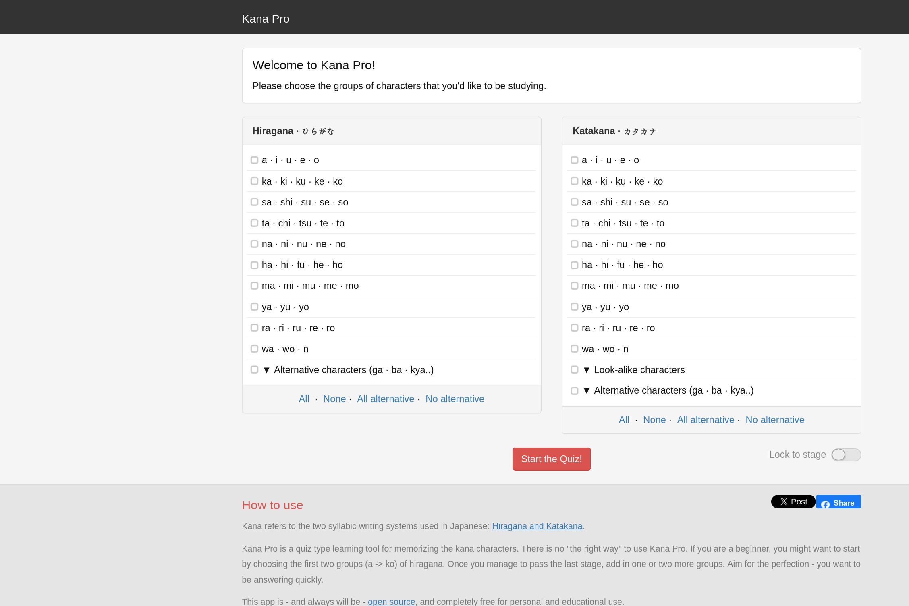
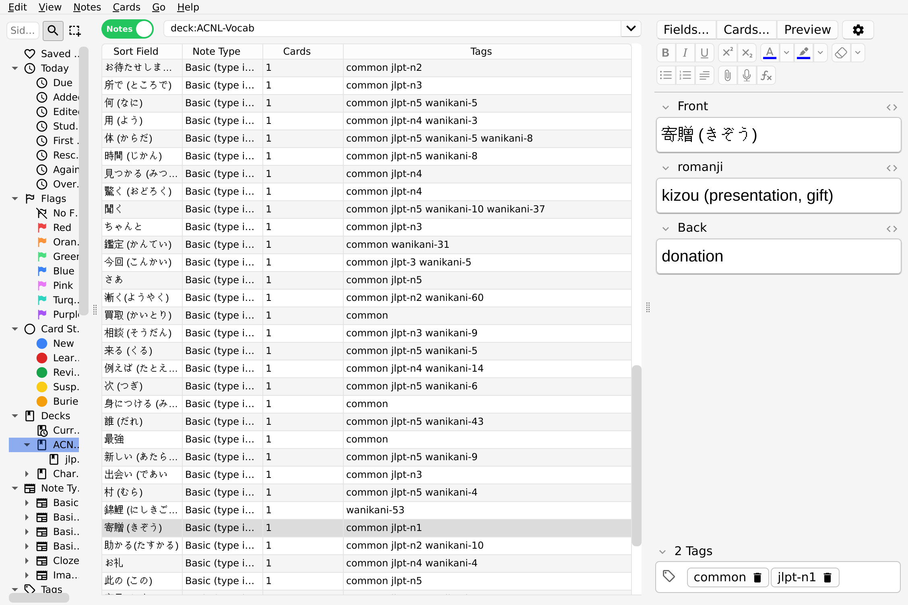

Since I'm gonna be playing my 3Ds anyway, I might as well...
<!-- more -->

## Backstory

Because of my switch to a flip phone, that has no wifi hotspot, I end up on the bus or waiting outside of places with nothing to do. So, I got a 3Ds off Ebay (see more about it in my [Flip Phone Quest]() post). However, I've played many 3Ds games so much that I can muscle-memory my way through most of the mechanics. The best example of this is Animal Crossing: New Leaf. Back in the day, I played Animal Crossing: City Folk on the wii. To get it, I traded my mom's friend son my copy of Mario Kart... to my dad's great dismay. But I adored it. I also played some Animal Crossing: New Horizons when that came out over covid. It was fun, but it was lacking in that Animal Crossing attention-to-detail and nuance. It was too focused on trendy crafting and sandbox mechanics that felt soulless relative to previous titles. That could just be nostalgia talking, but I picked up Animal Crossing: Wild World in my late teens (post New-Horizons) and found the world to be richer... most notably, they've just neutered the villager dialogue in these newer games (New Leaf included). This is a fairly widespread take, which this Screenrant article, [Animal Crossing Villagers Used To Be Real Jerks (& Way More Fun)](https://screenrant.com/animal-crossing-villagers-personalities-new-horizons-characters-boring/) gets the gist of.

Or even better, this rudeness compilation:

<iframe width="560" height="315" src="https://www.youtube-nocookie.com/embed/3rg5cbbeLmY?si=N9avigEjJ73v0lHJ" title="YouTube video player" frameborder="0" allow="accelerometer; autoplay; clipboard-write; encrypted-media; gyroscope; picture-in-picture; web-share" referrerpolicy="strict-origin-when-cross-origin" allowfullscreen></iframe>

Anyway, setting my Animal Crossing critical opinions aside, you know where repetitive dialogue can be helpful? Language learning! It's given new life to a game I've played to death. I couldn't just switch the language and dive right in; some prep was needed to pick up any Japanese as I played. 

## The Basics: Hiragana and Katakana

First, I needed to know the characters.

For hiragana, I used the some online quiz that has since disappeared. I added a new column of characters after I could get through a set without much hesitation. For katakana, which is still weak currently, I'm using the website [kana.pro](https://kana.pro/). There is a GNOME application called [Kana](https://flathub.org/en/apps/com.felipekinoshita.Kana) that I've used before, but it lacks some things I enjoy, such as:

1. typing out the answer rather than clicking it
2. gradually adding more characters rather than practicing all of them at once
3. a font that doesnt suck ass (I'm just having a desktop linux moment tbh)

However, I'd like to contribute to this project or create my own someday so I don't have the kana practice tool that I recommend to people randomly disappear once again.

Spending a lot of time on memorization for hiragana and katakana isn't necessary after you get basic recall down. My recollection improved gradually while sounding or typing things out in pursuit of more vocabulary words.

I would suggest returning to the hiragana and katakana quizzes if you find yourself skipping through a lot of dialogue because you're struggling to remember more than just 1 or 2 particular characters. I noticed myself doing this with katakana, since my hiragana was pretty strong, resulting in me avoiding katakana words that appeared in-game...

And as a sidenote, the font that animal crossing puts そ in did throw me at first, because it looks different from other common online fonts. RIP.

## Vocabulary

I installed anki and my ACNL vocabulary to one giant deck for now.

I am especially keen on adding JLPT-N5 words to my deck. But even if a word is less common, if I see it frequently in-game, I will still add it to my deck. I will take a lot of vocab from Reese's dialogue when you sell items, Isabelle's welcome dialogue, and other repetitive parts of the game. The word for "donation" (寄贈, kizou) wouldn't normally go into my anki deck, but Blathers says it every time I donate fossils to the museum. So, that makes it worth learning.

## Resources

[kana.pro](https://kana.pro/)

[Lexilogos Hiragana Keyboard](https://www.lexilogos.com/keyboard/hiragana.htm) and [Katakana Keyboard](https://www.lexilogos.com/keyboard/katakana.htm).

[Google translate](https://translate.google.com/?sl=auto&tl=en&op=translate)

[Jisho Japanese-English Dictionary](https://jisho.org/)

[JapanDict](https://www.japandict.com) to double-check definitions and get romanji.

[Anki](https://apps.ankiweb.net/)

[Nookipedia (flower breeding in new leaf!!)](https://nookipedia.com/wiki/Flower)

- use nookipedia instead of the fandom wiki... it's much nicer

## The Future

So, that's where I'm at right now. We'll see what I pivot to once I get bored of Animal Crossing: New Leaf.

The end-game though? Someday, I want to go to Japan with my Turlock friends :) none of us have been yet and we will absolutely tear it up !!!

<iframe width="560" height="315" src="https://www.youtube-nocookie.com/embed/qzdPTjk9aTg?si=mO8t7w5v-pH_nNsV" title="YouTube video player" frameborder="0" allow="accelerometer; autoplay; clipboard-write; encrypted-media; gyroscope; picture-in-picture; web-share" referrerpolicy="strict-origin-when-cross-origin" allowfullscreen></iframe>

my favorite song is 11PM tho
