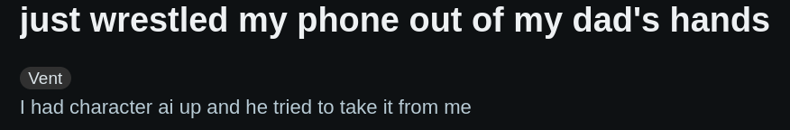

---
date:
    created: 2024-12-01
categories:
    - Writing
---

# Loving Someone Who Isn't Real

It's an embarrassing idea.

## Part 1: Portraits

<!-- more -->

> 'What we did with Sal is no comparison. We've been through this, Chrissie. What we made with Sal was a doll. A bereavement doll, nothing more. We've come a long way since then. What you have to understand is this. The new Josie won't be an imitation. She *really will be Josie*. A *continuation* of Josie.'

For this college class that I'm in, I read a book called *Klara and the Sun*. Then, I needed to listen to an NPR podcast called ["The Body Electric"](https://www.npr.org/series/1199526213/body-electric). After breezing past seven or so episodes with similar messages on how less screen time is good for you, one episode's title drew me in. Sadly, the title remained the most interesting thing about it: 

**If a bot relationship FEELS real, should we care that it's not?**

The episode is concerned with AI chat platforms, such as character.ai. They offer simulations of speaking to a psychologist, a fitness trainer, and, of course, a romantic partner. The podcast grasps for potential reasons that these chatbots are hazardous. They warn there is no empathy, no vulnerability, none of the friction or pushback that's so important for real human relationships. But after 26 minutes, the podcast doesn't get far past the surface-level repulsion we feel at the thought of "bot relationships".

I like dating sims. These are games where the primary objective is dating its characters. The Huniepop series is my favorite. The youtuber [Droneable](https://www.youtube.com/Droneable) has several videos that highlight why the games (and the girls they contain) are so great. Although the dialogue is written by a human man, and not AI, the cringe of having an AI girlfriend is a continuation of the same type of cringe of playing Huniepop. No matter how hard you try to convince people, and yourself, that this bot relationship does NOT feel real to you, they can't help but care. Regardless of how much humor and irony you dress it up with, you decide to spend your time romantically engaging with a fantasy instead of another human being, and that is strange to them. I'm going to broaden the definition of "bot relationships" to include any deep connections normally reserved for other human beings, which is then directed at something else. Whether that connection is built on love, lust, or loathing, so long as the recipient "isn't real", it's a bot relationship.

<iframe width="560" height="315" src="https://www.youtube.com/embed/GKOSOehA2r0?si=FbSe8iU4tqIpW2jc" title="YouTube video player" frameborder="0" allow="accelerometer; autoplay; clipboard-write; encrypted-media; gyroscope; picture-in-picture; web-share" referrerpolicy="strict-origin-when-cross-origin" allowfullscreen></iframe>

Take it to the extreme, and you have *fictosexuality*. The corresponding subreddit ([r/fictosexual](https://www.reddit.com/r/fictosexual/)) defines itself as "a community for people who find themselves intensely and lastingly attracted to fictional characters". To build a relationship with your f/o (fictional other), you can pursue the traditional mediums, such as romantic fanart or fanfiction of yourself and your f/o. You can own a plushie of them. If you're very dedicated, you can even shift into a different reality where they exist (see [r/shifting](https://www.reddit.com/r/shiftingrealities/) or [r/tulpas](https://www.reddit.com/r/Tulpas/)).

One common practice is to use character.ai or other AI chatbots to act as your f/o.

I think this is smart! It mimics that emotional high of texting a real person you're dating. You don't have to play both roles anymore, like you would when writing fanfiction. But one thing I noticed about the r/fictosexual community: most of its members are kids. Many posts mention concerns about family or school, and have the tone of a pre-teen or teenager.

 Maybe it's a stunted development thing, then. Kids lean into this phenomenon the most because it's simply about maturity; once you mature, you're supposed to drop the binkie and spend your time on real relationships instead.

## Part 2: Artificial Friends (AFs)

> 'Excuse me,' I said quickly. I didn't wish to take your privacy. I came on an important errand.'
>
> He didn't seem angry, but said nothing and went on watching me.
>
> 'AFs often do important errands,' I said. 'Josie sent me on this one.' I raised the envelope.

Involving technology in our social lives isn't limited to substitution and replacement. The other day, my friend showed me this app that they use with their boyfriend called "Memory Tree". You each answer daily questions, do other little tasks, and decorate a forest together; I thought it was very sweet. They found it helpful for communication and bringing them and their partner closer together.

I know other people who've used ChatGPT to get relationship advice and have been pleased with the results. You feed it texts between you two, some situational details, and you get back rational and unbiased feedback. The kind of feedback you couldn't necessarily get from a close friend, who is inherently partial to certain perspectives or people. Large language models, they argue, are pretty damn useful for this.

And of course, people have success on dating apps. It solves certain problems and can make it easier to pursue the relationships that they want.

So, the earlier idea of using technology to substitute real relationships induces cringe and second-hand embarrassment. On the other hand, using technology to *facilitate* real relationships is something I initially regarded with curiosity and admiration. However, I couldn't help but feel some twinge of horror deep in me.

## Part 3: We Grind Our Own Beef

> 'This is the place. They're inside there.' Then she said: 'Paul does have a point. They need to be by themselves sometimes. Just them. They need that. We shouldn't always be with them. You see that, Klara?'

In spite of the merits of these tools, my instinct is to run as far and fast as possible. For one, I have my own hang-ups about data privacy. Encrypted messaging is a must. Texting sucks, calling is better, in-person is best. Actually, I only send my love letters by pony express to the boy I met at the local saloon. It's all natural, normal, and analog.

[Nope, I'd never host my wedding in Final Fantasy XIV](https://www.eurogamer.net/meet-the-final-fantasy-14-players-who-marry-in-the-game-and-in-real-life). That'd be insane. But, I suppose I do secretly stash away that diamond I found in co-op Stardew Valley until I can craft an in-game wedding ring for that other player who gives me butterflies. And I do have a Steam collection of my best two-player "first date games" for when the need arises.

Look, my real driver is to keep external forces out of my relationships. Video games are safe; they are simply a solid vehicle for spending time with someone. But large language models, the opinions of others, the different content algorithms out there, I don't want any of it rattling around in my head and influencing how I feel. Because at the end of the day, a relationship is just between two people, and no one else. All that other stuff will fall away. So, no middlemen. No dating apps, no couples apps, no therapy. We grind our own beef.

But, to hear from an external force on how these things are connected (tech as both a relationship substitute and facilitator), I tapped into my prolific academic network.

> "It's a doll. Or a teddy bear. Sometimes, if you're hurting, it's nice to have a teddy bear...until you can grow and move on." - my mom

This is a kind approach. It aligns well with my earlier theory of stunted development. But, it also oozes snob and infantilization in a way that I dislike.

Really, how much better are we the grown-ups, who do our relationships with real people? When you have a crush on someone, you fantasize about how a relationship with them *could* be. When you are in love with someone, you may find that you are more in love with *the idea* of that person than the actual person. And when you go through a bad breakup, you come to that classic, universal realization: the person you were in love with no longer exists. You fell in love with the version of them who would have been different; someone who only exists in your head. There are often layers of fiction baked into our real relationships. Just as embarrassing, just as cringe. They are not inherently more evolved than a "bot relationship" unless you work for them to be.

Secondly, I don't agree that avoiding tech that facilitates relationships implies that you have a stronger relationship. Some people are long distance, or have stressors like both parties working long hours. It's not that the relationship couldn't stand on its own, but these little technologies are merely nice. You aren't dependent on any chatbot to process your feelings; it's just a helpful tool. As with bot relationships, I'm hesitant to write off these things off as crutches for the emotionally immature.

She could be right, though. We might all grow out of it. The specific topics I've touched on are most relevant to chronically online people currently in their twenties or younger; I will not be explaining fictosexuality to my dad until I have to. The knowledge we possess about relationships and our own needs is still developing. So, if one of us manages to stumble across something in this world that makes us happy, that feels real, who cares if it's not?

And if a drifter says some shit, just block that internet freak!

<iframe width="560" height="315" src="https://www.youtube.com/embed/CNPdO5TZ1DQ?si=ee-U3T3roZ0VLSf1" title="YouTube video player" frameborder="0" allow="accelerometer; autoplay; clipboard-write; encrypted-media; gyroscope; picture-in-picture; web-share" referrerpolicy="strict-origin-when-cross-origin" allowfullscreen></iframe>

<iframe width="560" height="315" src="https://www.youtube.com/embed/V37TaRdVUQY?si=u4ZPoLrzQsZtpVrp" title="YouTube video player" frameborder="0" allow="accelerometer; autoplay; clipboard-write; encrypted-media; gyroscope; picture-in-picture; web-share" referrerpolicy="strict-origin-when-cross-origin" allowfullscreen></iframe>
