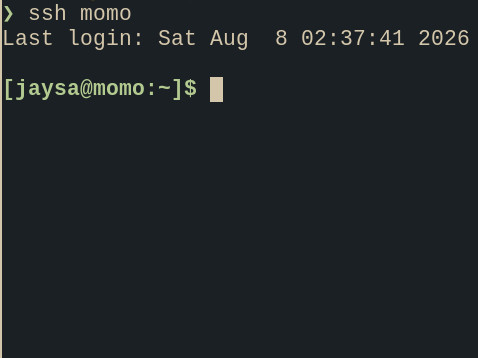
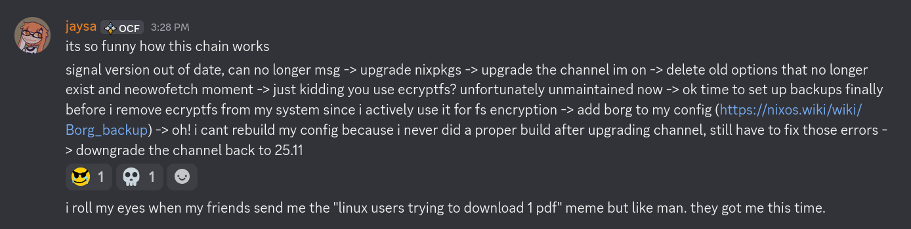

---
date:
    created: 2026-07-29
    updated: 2026-08-14
categories:
    - Miscellaneous
---

# Don't Worry, I'm Alive


<!-- more -->

As the more observant of you may have observed, [jaysa.net](https://jaysa.net) went down a week in July (shoutout to [joe](https://joewang.me), elsie, and joy!!!!). I need to set the goal of actually getting blog posts out the day that I write them... otherwise the whole "created" date becomes a bit confusing.

## My No WiFi Experiment

Normally I'd get internet and plug in `kyu`, the computer, and be set. But... I'm doing a no-wifi experiment for myself in my apartment (at first I was just being forgetful. then I started to like it). Nonetheless, when I do have Wi-fi at work or elsewhere, I want to have a box to mess around on, so it's VM time.

## `momo` the Hetzner VM



Debian to NixOS with this one cool trick:

```
curl https://raw.githubusercontent.com/elitak/nixos-infect/master/nixos-infect | PROVIDER=hetznercloud NIX_CHANNEL=nixos-25.11 bash -x
```

Had to make a swapfile first... failed before because no space. But then it worked. Then I went to configuration.nix, allowUnfree, install claude-code. Then I pointed it at my github repo [jaysa68/jaysa.net-web](https://github.com/jaysa68/jaysa.net-web) and told it to not keep the weird docker stuff I had going on, just configure it in nix more simply. Fixed my DNS records for IPv6 for letsencrypt and let it rip. Whole thing took like 2 minutes. I am pleased with how quickly Namecheap DNS changes propagated. And the site now rebuilds when a new commit is on github, which had been on my bucket list for months.

One problem: on my blog, I had some big files which I hadn't stored in git, such as the JAYSACRAFT modpack. Do I get these off of `kyu`? Eh. I'll do it later.

## 1 week later

OK, I proceeded to work and buy furniture and have my birthday. Then, on Thursday 8/6/2026, my signal version was out of date.



So borg is set up to do nightly backups now... but then my VM was too small (28GB or something). So, I got more space. I want to be pretty inclusive when it comes to the files I back up, at least for the most accessible backup, since you never know.

## Bonus

[u/leesajane on r/traderjoes: Trader Joes Lavash Bread Aram Sandwich](https://www.reddit.com/r/traderjoes/comments/vl7chn/trader_joes_lavash_bread_aram_sandwich/)

In case this reddit post ever gets deleted, I'm putting the recipe here.

- Trader Joe's products: Lavash Bread, baby spinach, turkey slices, baby swiss slices.
- Also used: Garden Vegetable Cream Cheese and pepperoncinis. 

## 8/8/25 grocery list

- milk
- sugar
- bagel
- cream cheese (another for bagels)
- mac n cheese
- bananas
- tomato soup

## 8/14/25

I went home this weekend and let this rot in my fridge on accident. Man. Man. OK, new post soon. Still not off of ecryptfs and up a nix channel version. Just did a signal overlay so I had a recent enough version to use it. Jank. But.... rice of the century... is on its way.
