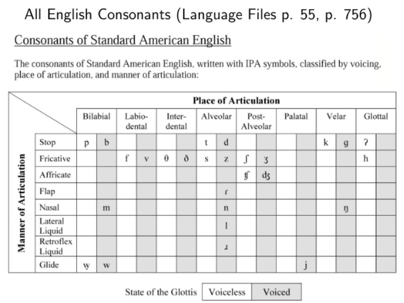

---
date:
    created: 2025-10-16
categories:
    - Miscellaneous
---

# Linguistics Midterm Review

As of 9:53PM, October 16th 2025, I am in poor shape

<!-- more -->

## Phonetics

Resources:

- [ipa.typeit.org](https://ipa.typeit.org/full/)
- [ipachart.com](https://www.ipachart.com/)
- [Interactive Sagittal Section](https://incl.pl/sammy/)

### Module 2: Articulatory Phonetics

**Prescriptivism** - imposing a set of rules that dictate how language should be used

**Descriptivism** - articulating a set of rules that describe how language is used based on observation, as opposed to making value judgments about the ways people use language.

---

Rows = manner of articulation

Columns = place of articulation

Cell Position = voicing. Left = voiceless, Right = voiced

#### Stops (plosives)

- voiceless bilabial stop: [p] - "ta**p**"
- voiced bilabial stop: [b] - "**b**at"

 

- voiceless alveolar stop: [t] - "**t**oe"
- voiced alveolar stop: [d] - "**d**ab"

 

- voiceless velar stop: [k] - "ta**ck**"
- voiced velar stop: [g] - "**g**ap"

 

- voiceless glottal stop: [ʔ] - "uh**-**oh"

#### Fricatives

- voiceless labiodental fricative: [f] - "**f**at"
- voiced labiodental fricative: [v] - "**v**at"

 

- voiceless interdental fricative: [θ] - "**th**ink"
- voiced interdental fricative: [ð] - "**th**is"

 

- voiceless alveolar fricative: [s] - "ye**ss**ir"
- voiced alveolar fricative: [z] - "ye**zz**ir"

<iframe width="560" height="315" src="https://www.youtube.com/embed/oFP6tss8ODE?si=7fOoID3XR5AO2bE5" title="YouTube video player" frameborder="0" allow="accelerometer; autoplay; clipboard-write; encrypted-media; gyroscope; picture-in-picture; web-share" referrerpolicy="strict-origin-when-cross-origin" allowfullscreen></iframe>

 

- voiceless postalveolar fricative: [ʃ] - "**sh**ip"
- voiced postalveolar fricative: [ʒ] - "vi**s**ion"

 

- voiceless glottal fricative: [h] - "**h**ip"

 

#### Affricates

- voiceless postalveolar affricate: [tʃ] - "**ch**ip"
- voiced postalveolar affricate: [dʒ] - "**j**ar"

#### Flaps

- voiced alveolar flap: [ɾ] - "bu**tt**er"

#### Nasals

- voiced bilabial nasal: [m] - "ba**m**"
- voiced alveolar nasal: [n] - "ba**n**"
- voiced velar nasal: [ŋ] - "ba**ng**"

#### Approximants

- voiced alveolar lateral approximant: [l] - "**l**ip"
- voiced alveolar approximant: [ɹ] - "**r**ip"

 

- voiced palatal approximant: [j] - "**y**ep"

#### Glides

- voiceless labiovelar approximant (glide): [ʍ] - "**wh**ich" (for some speakers)
- voiced bilabial glide: [w] - "**w**ide"

---

## Phonology

- **Glottalic egressive** - a closure is produced in both the mouth and glottis, and then the glottis is raised to increase pressure in the mouth. The result is a strong "popping" release sound known as an ejective.

- **Glottalic ingressive** - a closure is produced in bot hthe mouth and the glottis, and then the glottis is lowered to decrease the pressure in the mouth. The result is a resonant or "hollow" sound release known as an implosive.

- **Velaric ingressive** - a closure is produced by the root of the tongue and some other part of the tongue at the same time. The tongue is then lowered to decrease the pressure in the mouth, and the result is a click sound.

- high front unrounded tense: [i] - "b**ea**d"
- high front unrounded lax: [ɪ] - "b**i**d"

 

- mid front unrounded tense: [e]
- mid front unrounded lax: [ɛ] - "b**e**d"

 

- low front unrounded lax: [æ] - "b**a**d"

 

- high back rounded lax: [ʊ] - "b**oo*k"

 

- mid back rounded tense: 
- mid back rounded lax: [ɔ] - "st**o**rm"

 

- low back unrounded lax: [ɑ] - "b**o**d"

 

- mid central lax (stressed): [ʌ] - "b**u**ck"
- mid central lax (unstressed): [ə]

- [o]
- [u] - "b**oo**ed
- [ɑɪ] - "b**i**te"
- [e] - c**a**ne

 

- [oʊ] - "both"
- [ɑʊ] - "growl"

## Morphology

- **Inflectional**: change some grammatical property of a word without changing the lexical category
- **Derivational**: creates a new word (lexeme) with a distinct meaning, foten a different lexical category or otherwise fundamentally changing the meaning

- **Phonologically conditioned allomorphy**: THe phonological environment (something relating to sounds) conditions which allomorph of a morpheme appears

- **Morphologially conditioned allomorphy**: A morphological feature like [PAST TENSE] or [3SG], conditions which allomorph of a morpheme appears.

- **Lexically conditioned allomorphy**: Individual lexical items condition which allomorph of a morpheme appears. There is no phonolgical or morphological way to predict which allomorph you get.
