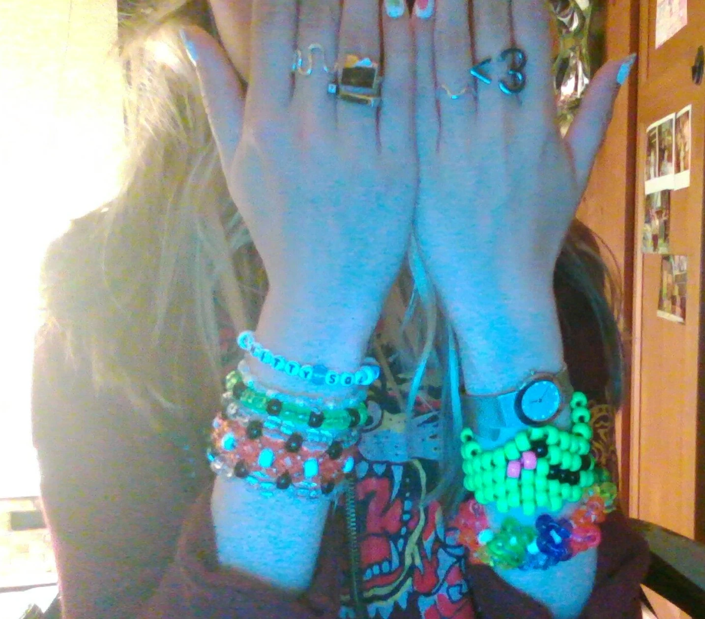
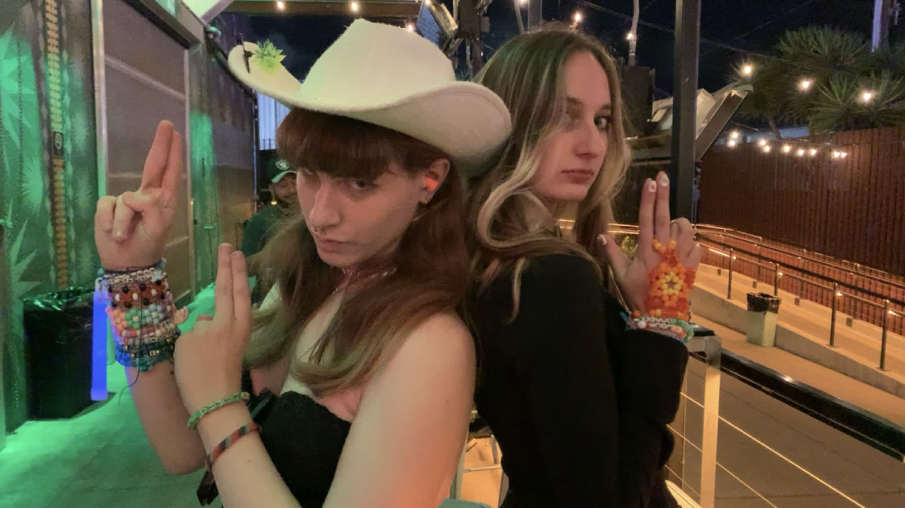
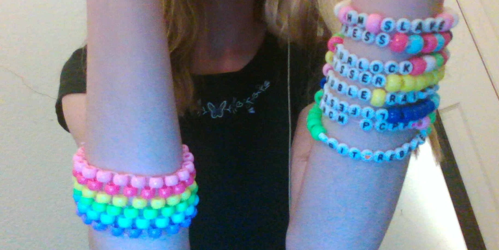
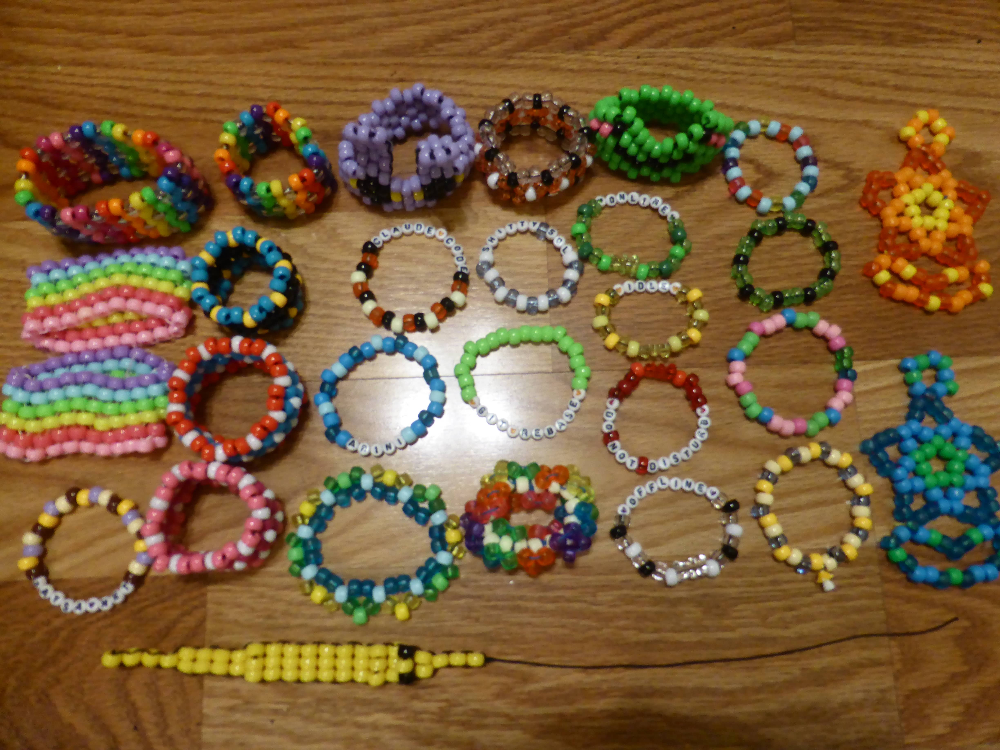

---
date:
    created: 2026-06-22
pinned: true
---

# Little Kandi Quest ⋆｡°✩☾⋆｡°✩

beads + string are pretty fun, u should try!

<!-- more -->

## Intro

Making kandi reminds me of knitting. Definitely a lot easier though. I'll come
back to knitting someday when I am older, wiser, and it gets cold out.

I started this for a rave a bunch of my friends wanted to attend, so we could
give bracelets out. Or it was for friendship bracelets that had the usernames
of my friends from the Open Computing Facility, who were graduating with me.
Maybe it was both? I went to Hobby Lobby and then got a little more into it
than I had intended.

## Raving!

Kandi is heavily associated with raves. Am I, though?

I actually don't enjoy raves too much. They're fine, I guess. Better than clubs
because raves have better music. However, I get overwhelmed by all the lights
and sound and I'm not really sure what to do with myself. Dancing is fun for a
bit, but I get bored and my body gets tired. And I can't talk to people because
the music is too loud. To feel better and enjoy it, I've gotta be inebriated or
on something, which then puts me in danger of being harassed. I also often get
too messed up, become a burden to my friends, and struggle to get my ass home!
I don't like that; I like being independent and able to take care of myself.

LATER: I wrote that paragraph a few nights ago, where I went into the event
already very tired. All of what I said is true sometimes, but other times I'm
super excited to go out and have a blast!!! There are a lot of factors that can
lead to you having a good or bad night, and it's a matter of figuring out what
works for you. I'm still figuring it out the hard way, so I have no concrete answer
for my preferences to put here yet. But have this cute photo of me and Elsie
([@peach_flavored_ecstasy](https://www.instagram.com/peach_flavored_ecstasy/))
from a recent hardstyle show. If you'd asked me *this* particular night what I
thought of raves and going out, I'd have had a more positive answer >:)

## And Elsewhere

Even if it isn't at a rave, I do adore giving out kandi :D Concerts, parties,
small children in public... and of course it's great making customized stuff
for my friends.

I like the idea that if my future kid wants some toy (such as a worm on a string), I can go "No. We have worm on a string at home." and then make them one of their preferred color out of beads. I could make a rainbow translucent worm. My worm can eat your store-bought worm for breakfast. All it costs is a bit of my time and my love <3

LATER: I made the worm. it is a bit worse than a normal worm on a string. but it does contain my love (see him below)

## Tricks of the Trade

I started with **pony beads** (the most common type you'll see for kandi) and some
letter beads. You can do more interesting bead types and add charms too! But
pony beads are the most versatile and basically all that I use. Here's what my first few bracelets looked like:

The cut-off one says "Huntress" and has her Risk of Rain 2 colors kinda. Then there's HM Slave, Double Rainbro (a solid dutch bros order), Turlock, and ncmpcpp (my favorite TUI music listening client). Although I'm making more complex kandi a few weeks later... hard to top these singles ngl.

One trick to making good kandi is to maintain tension. In other words, use as
little string in there as possible. Keep it taut as you go, but don't strain
your fingers unnecessarily. When I want to test the fit of something, I'll tie
just one knot and hold that down, then try it on. Once you've done your 3-5 knots,
you've sealed your fate.

And if you're planning on giving some out, make many different sizes. Different
sizes are even helpful for stacking on just your own arm, since the width of
your arm increases farther up.

## Inspiration

As proof of my qualifications, here is my current kandi collection. A few will be given away, many not pictured already have been, and others here you'd have to pry from my cold, dead, bead-wrapped hands (in particular that rainbow saturn cuff, I love it so).

Many of these designs are from tutorials or take heavy inspiration from posts that I've seen online. Here's some tutorials I've followed myself to make things and that I can recommend. The later they're listed, the more recently I attempted them... so the easier tutorials are closer to the top.

- [Hazel Muffins: Kandi Cuff Tutorial Odd Peyote](https://www.youtube.com/watch?v=zmqYEiC8MTM)
- [Stego Doodle: Lizard/Gecko Kandi Charm Tutorial](https://www.youtube.com/watch?v=kkvZuBCqb3U)
- [How to Make a Kandi Star - \[Kandi Tutorial\] | @GingerCandE](https://www.youtube.com/watch?v=wBv4p6pptfo)
- [Saturn Kandi Cuff \[Kandi Tutorial\] | @GingerCandE](https://www.youtube.com/watch?v=JjABjpXEH84)
- [Stego Doodle:  kandi Star Glove Tutorial ](https://www.youtube.com/watch?v=sPsJDlcGwd8)
- [Hazel Muffins:  Kandi Tutorial Flower Cuff](https://www.youtube.com/watch?v=0m55_HP5YGA)
- [Stego Doodle: Basic Kandi Cuff Tutorial (X-Base Cuff)](https://www.youtube.com/watch?v=62B3O1uJQrE)
- [Stego Doodle: Frog Kandi Cuff Tutorial!](https://www.youtube.com/watch?v=perq4E9spMo)
- [@oofster_yeets: Jax Bracelet Tutorial!](https://www.tiktok.com/@oofster_yeets/video/7542429822904012046)

Stuff I'd like to make soon:

- [ROTATING KANDI CUFF TUTORIAL (TWO STYLES) ☆ Spiked / Round Kandi Rotators ](https://www.youtube.com/watch?v=p2KArVFyJEU)
- [KarinaDYST: How to make a kandi square bag ☆ ](https://www.youtube.com/watch?v=FN8F99Kr5JE)

Pinterest is a good source for color scheme ideas. And phrases to put, if you're feeling verbally challenged. Gotta keep the text short so it fits in one line on your wrist, or you can make a set of bracelets with all of your text on it.

Stego Doodle is my favorite tutorial channel at the moment. She's an active channel too; posting great stuff as of writing! Some tutorials of hers will say you need to use non-stretch cord to get the right look (aka so the kandi doesn't scrunch up on itself for something like a lizard or a worm on a string). But in my experience, if I get the tension right, it'll still turn out pretty well.

Once you're really good you can hop on [kandipatterns.com](https://kandipatterns.com/) and play it by ear.

Definitely check out the dedicated subreddit, there are very cool things on
[r/kandi](https://www.reddit.com/r/kandi/). The post [r/kandi: How to make less floppy?](https://www.reddit.com/r/kandi/comments/1sz2fsp/how_to_make_less_floppy/)
is really funny. Why does she flop it around like that. Why does the sharpie
fall out like that. Why 

<video controls width="30%">
  <source src="/assets/little-kandi-quest/less_floppy.mp4" type="video/mp4">
</video>

The concept of a tap-to-pay magic wand is sick however. I hope she got it to stick up eventually.

## Bonus thoughts

The majority of kandi content out there is by young, even preteen, girls. A lot
of talk about moms buying beads. I may be an adult, but I am a mere follower of
these real innovators in the kandi space. Perhaps something about starting my
first full-time job regressed me and now I cling to kid things.
It's probably just a phase, but it's one that I'm thoroughly enjoying.

I like how kandi allows me to make accessories very quickly that can be themed to whatever I'm going to, and that I don't mind parting with. 4th of July, SF Pride, Halloween, new video games, movie premieres... I have an extra way to be festive now :D

Also, if you get tired of something you made or received, you can cut it up and
re-use the beads for something new. That's so cool. All you lose is some
string, and you can even reuse that too.

music for when you finish some kandi and u love it:

<iframe width="560" height="315" src="https://www.youtube-nocookie.com/embed/CFVAE23tekc?si=XF5bWftSl6vuU3hc" title="YouTube video player" frameborder="0" allow="accelerometer; autoplay; clipboard-write; encrypted-media; gyroscope; picture-in-picture; web-share" referrerpolicy="strict-origin-when-cross-origin" allowfullscreen></iframe>

<iframe width="560" height="315" src="https://www.youtube-nocookie.com/embed/qjxEnzfz6pQ?si=7TBz3n-OUYe7A-YH" title="YouTube video player" frameborder="0" allow="accelerometer; autoplay; clipboard-write; encrypted-media; gyroscope; picture-in-picture; web-share" referrerpolicy="strict-origin-when-cross-origin" allowfullscreen></iframe>

<iframe width="560" height="315" src="https://www.youtube-nocookie.com/embed/dbDoHitH6wU?si=7iWoCYwniD7NBrGv" title="YouTube video player" frameborder="0" allow="accelerometer; autoplay; clipboard-write; encrypted-media; gyroscope; picture-in-picture; web-share" referrerpolicy="strict-origin-when-cross-origin" allowfullscreen></iframe>

<iframe width="560" height="315" src="https://www.youtube-nocookie.com/embed/TR423x1Q_Nk?si=XxcD8A3T4VV7clFS" title="YouTube video player" frameborder="0" allow="accelerometer; autoplay; clipboard-write; encrypted-media; gyroscope; picture-in-picture; web-share" referrerpolicy="strict-origin-when-cross-origin" allowfullscreen></iframe>
