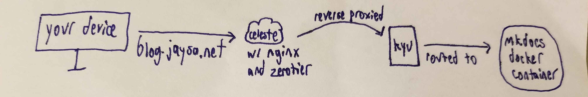
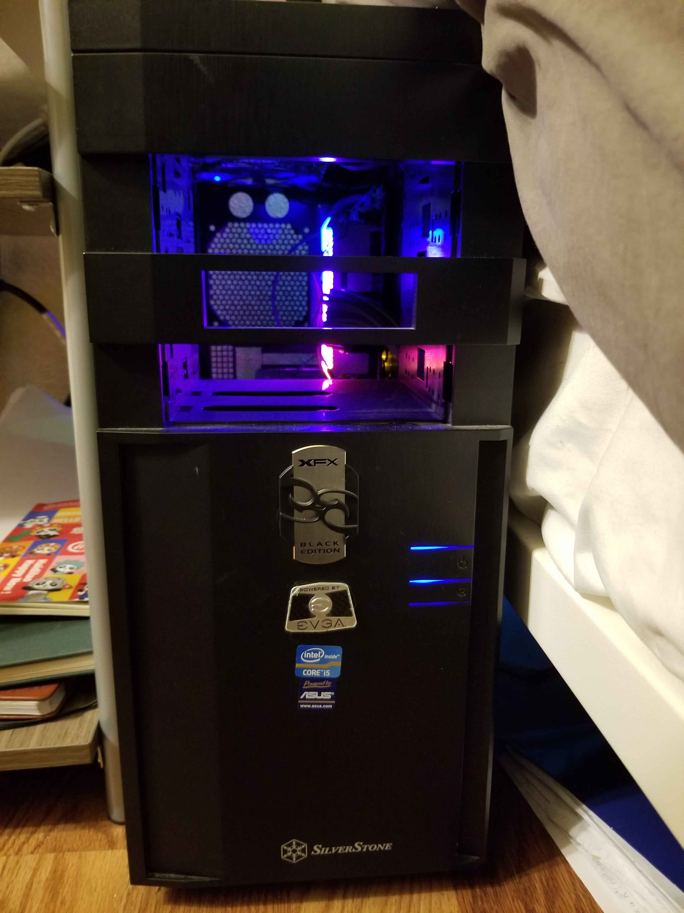

---
date:
    created: 2024-12-03
pinned: true
categories:
    - Tech
---

# December 2024 Homelab Overview

I got into self-hosting last summer for a few reasons:

1. It's a great way to learn new sysadmin stuff without worrying about breaking something and ruining someone's day.
2. I like the idea that my files, notes, and other data are accessible from anywhere, but still owned by me.
3. It makes me feel cool! B-)

Guides such as [bencuan's TurtleNet](https://devlog.bencuan.me/series/turtlenet) and [Gurucomputing Blog](https://blog.gurucomputing.com.au/) were instrumental to me setting up my own infrastructure. I hope this description of my setup can spark ideas in someone else, too.

<!-- more -->

## Celeste

`celeste` is a GCP (Google Cloud Platform) e2 micro VM instance running Debian. She does 2 things:

- Reverse proxy incoming traffic for `jaysa.net`
- Host uptime kuma to monitor the status of my services

`celeste` and my `lightning` are my only hosts with static IPv4 addresses. The VM costs a few cents a month for outgoing traffic, but otherwise my GCP usage stays within the free tier. 

All traffic from the outside first hits my reverse proxy, `celeste`. Then, NGINX directs the traffic to the correct port on my main server, `kyu`. This port is mapped to the exposed port of the docker container running the service. Both hosts are in my Zerotier private network, so even though `kyu` is not public-facing, they can communicate.

The only service that doesn't go through Celeste is `minecraft.jaysa.net`, because there  was too much traffic and GCP's egress fees got expensive (~$30/month!).

## Kyu

`kyu` is my main server. She's a PC that I built for the purpose of self-hosting. The case is ancient and missing parts because it was scavenged from my dad's shed. The CPU is an old one I got from my ex-boyfriend that had been dropped, and I spent hours straightening out its bent pins with a credit card. I spared every expense. And I am very emotionally attached to this computer.

Software-wise, I considered using a hypervisor such as Proxmox. However, because I do not have access to ethernet where I live, I found it easiest to run my services on bare metal Archlinux in Docker containers. Listed below are my services as of today, but you can always check [huniebee.jaysa.net](https://huniebee.jaysa.net) for an updated list.

 | Name | Description |
| ----------- | ----------- |
| [jaysa.net](https://jaysa.net/) | my personal website |
| [berkeleyfee.org](https://berkeleyfee.org/) | website with info on UC Berkeley student fees |
| [this blog](https://squidfunk.github.io/mkdocs-material/) | mkdocs material with the blog plugin |
| [outline](https://www.getoutline.com/) | documentation platform, but I use it like Notion |
| [coder](https://coder.com/) | cloud development environment |

 >At first, I set up my instance of Uptime Kuma on `kyu`... and then I remembered that `kyu`'s uptime is what I'm tracking!! Sometimes it dies because the internet goes out, sometimes it's the power, and occasionally things just crash. But unlike the Jaysa Cloud Platform, Google never goes down. So I can always see how bad things are.

Things load a little slower than I'd like because she lacks ethernet and is on a weak, shared wifi network that I don't control. This is fine for most services most of the time, but it used to cause severe lag on `minecraft.jaysa.net` when many players were on. So, I moved that to `lightning`.

## Lightning

`lightning` is my [OCF staff](https://www.ocf.berkeley.edu/about/staff) VM. At the moment, it only runs my modded minecraft server.

## DNS

I use [Namecheap](https://www.namecheap.com/) as my domain name registrar. I could switch to Porkbun or something, but Namecheap doesn't give me any problems.

## Email

I use Zoho for free email hosting with a custom domain (`jaysa.net`). I also have wildcard email set up; I find it very convenient.

## Todo

- [ ] Have `kyu` issue SSL certificates instead of `celeste`
- [ ] Figure out how I want to do backups
- [ ] Move everything to NixOS...? :O
