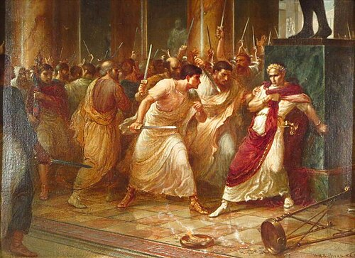

---
date:
    created: 2026-04-18
categories:
    - Writing
---

# Why Startups Are Kinda Marxist

<!-- more -->

if you think about it

## Context

I have a midterm on Marx's Capital coming up.

I have a job at a startup which I will start after I graduate.

I have a slideshow to present for the OCF tonight.

I must reconcile these things; you will bear witness.

## Value

What is value? How would you all define it?

**Money**: This is an intuitive answer.  And yet, Marx says:

> The change in value of money which has to be transformed into capital cannot take place in the money itself, since in its function as a means of purchase and payment it does no more than realize the price of the commodity it buys or pays for, while, when it sticks to its own peculiar form, it petrifies into a mass of value of constant magnitude

Basically, money in a vacuum isn't going to spawn in more money. The consumption of someone's labor-power is necessary.

> We mean by labour-power, or labour-capacity, the aggregate of those mental and physical capabilities existing in the physical form, the living personality, of a human being, capabilities which he sets in motion whenever he produces a use-value of any kind.

- consumption of the labor power is what generates value! labor is the secret ingredient you add to other commodities (capital) to make them self-valorizing!!!

### Um, what if you waste your labor-time on some dumb shit that isn't valuable to anybody?

defining the productive power of labor

> The quantity of value of a commodity accordingly would remain constant if the labour-time required for its production were constant. The latter, however, changes with each change in the productive power of labour. The productive power of labour is determined by manifold conditions, among others by the average grade of competence of the workers, the level of development of science and its technological applicability, the social combination of the process of production, the scope and the efficacy of the means of production, and by natural relationships. The same quantum of labour manifests itself after propitious weather in 8 bushels of wheat, but after impropitious weather, in only 4, for example. The very same quantum of labour provides more metals in richly laden mines than in poor ones, etc.

**wash-out**

## Productive Consumption

### productive and unproductive labor

>A large part of the annual product, the part consumed as income and no longer re-entering production afresh as a means of production, consists of extremely paltry products (use values), serving to satisfy the most miserable appetites, fancies, etc.

- meals provided at work, other various "benefits" commonly provided silicon valley tech offices
- fallacy of the greedy worker and the generous capitalist

## Where am I most satisfied expending my labor-time?

- shares = means of production
- motivated beyond base salary, want company as a whole to do well
- less toxic competitiveness: not performing productivity to claw down your coworkers for capitalist scraps, but supporting them because you have an interest success of entire company

- it feels like OCF.... :D

## Drawbacks, Hesitation

### Hm... retrofitting my schedule for capital...

> The difficulties in fact would be so great that they would very likely lead to the giving up of night-work altogether, and “as far as the work itself is concerned,” says E. F. Sanderson, “this would suit as well, but —” But Messrs. Sanderson have something else to make besides steel. Steel-making is simply a pretext for surplus-value making. The smelting furnaces, rolling-mills, &c., the buildings, machinery, iron, coal, &c., have something more to do than transform themselves into steel. They are there to absorb surplus-labour, and naturally absorb more in 24 hours than in 12. In fact they give, by grace of God and law, the Sandersons a cheque on the working-time of a certain number of hands for all the 24 hours of the day, and they lose their character as capital, are therefore a pure loss for the Sandersons, as soon as their function of absorbing labour is interrupted. 

<<\< what victorian children slaved over to exhaustion i think

- furnaces need to be worked at night, wasting capital vs wasting labor time
- im not a child techncially, but i work late at night because it's more efficient for capital (no one is making calls at night, good time for database migrations and other downtime changes)

## Real footage of a schema migration in San Francisco, California being performed on Macbook M1 Pros

## Procreation (the OCF, you all!)

> The owner of labour-power is mortal. If then his appearance in the market is to be continuous, and the continuous conversion of money into capital assumes this, the seller of labour-power must perpetuate himself, “in the way that every living individual perpetuates himself, by procreation.” The labour-power withdrawn from the market by wear and tear and death, must be continually replaced by, at the very least, an equal amount of fresh labour-power. Hence the sum of the means of subsistence necessary for the production of labour-power must include the means necessary for the labourer’s substitutes, i.e., his children, in order that this race of peculiar commodity-owners may perpetuate its appearance in the market.

(think Little Boxes, the South Bay as a center for the soulless propagation of upper-middle class larvae)

BUT, I think this can be done optimistically.

joking in car about maximizing the chances of my children growing up to join OCF

**but you guys are my social reproduction. anyone who believes in the values of the ocf. and the people i encounter from here on out at arini!!

# **i hope to perpetuate my appearance in the market forever :)**

Sources:
- Karl Marx, Capital Volume I (Penguin CLassics)
